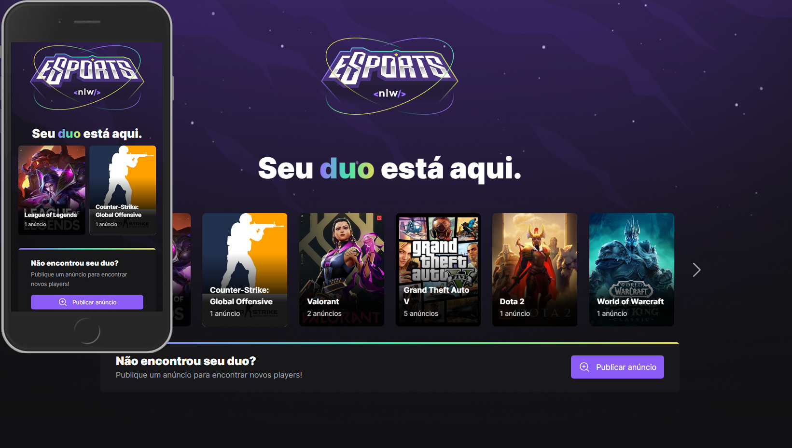

# NLW eSports

Evento da [Rocketseat](https://www.rocketseat.com.br). Aplicação Full Stack para conectar jogadores.

## Requisitos
- [Node](https://nodejs.org) versão LTS
- [npm](https://www.npmjs.com) or [yarn](https://yarnpkg.com/getting-started/install)
- [Expo](https://docs.expo.dev/get-started/installation)

## Instruções

1. 1
2. 2
3. 3
4. 4
5. 5
6. 6

## Tech Stack

- [TypeScript](https://www.typescriptlang.org)

### Backend

- [Node](https://nodejs.org)
- [Express](https://expressjs.com)
- [Prisma](https://www.prisma.io)
- [SQLite](https://www.sqlite.org/index.html)
- [yup](https://github.com/jquense/yup)

### Web

- [React](https://reactjs.org)
- [Vite](https://vitejs.dev)
- [Tailwind](https://tailwindcss.com)
- [Radix UI](https://www.radix-ui.com)
- [React Hook Form](https://react-hook-form.com)
- [Axios](https://axios-http.com)
- [yup](https://github.com/jquense/yup)

### App

- [React](https://reactjs.org)
- [React Native](https://reactnative.dev)
- [Expo](https://docs.expo.dev/index.html)
- [React Navigation](https://reactnavigation.org)
- [Axios](https://axios-http.com)

## Alterações minhas incluem

- Responsividade no aplicativo Web
- Validação de dados no backend e na Web
- Slider para os games na Web
